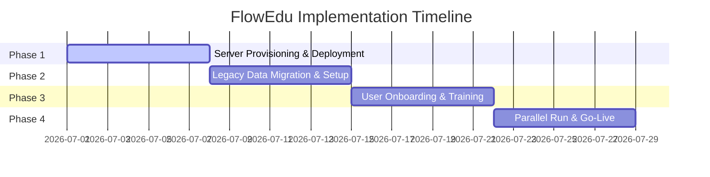

# SOFTWARE IMPLEMENTATION & LICENSING PROPOSAL

**PREPARED FOR:** [Client Institution Name / School Name]  
**PROJECT NAME:** Implementation of FlowEdu School Management System  
**DATE:** June 30, 2026  
**PREPARED BY:** [Your Company/Name]  
**CONTACT:** [Your Email / Phone Number]  

---

## 1. Executive Summary

In today’s competitive educational landscape, academic institutions require an integrated, reliable, and real-time operational backbone. Traditional paper-based methods, fragmented systems, and manual entries introduce significant administrative overhead, lead to grading and transcript inaccuracies, slow down tuition tracking, and limit leadership visibility.

**FlowEdu** is a comprehensive, enterprise-ready College & School Management System designed to consolidate your academic, administrative, and financial workflows into a single, high-fidelity platform. FlowEdu connects students, teaching staff, administrators, and finance officers within a secure, responsive web ecosystem.

### Key Project Objectives:
* **Eliminate Operational Silos**: Unify registration, grading, tuition invoicing, and communication under a single portal.
* **Guarantee Academic Accuracy**: Secure grades submission, automated GPA calculation, HOD/Dean verification, and instant official transcript generation.
* **Secure Revenue Management**: Real-time tuition invoice calculation, scholarship tracking, online proforma quotes, and automated receipts.
* **Enhance Decision-Making**: Comprehensive academic, financial, and attendance reporting with graphical dashboards for senior management.

---

## 2. Technical Architecture & Security

FlowEdu is built using a modern, industry-standard technology stack that guarantees speed, responsiveness, and enterprise-grade security:

* **Backend Engine**: Built on the **Laravel 12** framework, leveraging robust object-relational mapping (Eloquent), secure session handling, and database integrity.
* **Reactive Frontend**: Utilizes **Livewire 3** and Alpine.js to deliver a fast, app-like, responsive user experience without constant page reloads.
* **Responsive Styling**: Crafted using TailwindCSS and Font Awesome, ensuring full usability across mobile, tablet, and desktop screens.
* **Data Isolation**: Single-tenant deployment architecture. Your institution gets its own dedicated database instance, ensuring absolute data isolation and compliance with data protection standards.
* **Audit Trail**: Every administrative action, user login, and profile modification is tracked in real-time system logs. It supports **Admin Impersonation** for secure troubleshooting, with all actions recorded in audit tables.

---

## 3. Core Modules (Included in Base Core Licence)

The base FlowEdu licence establishes your core campus network and administrative workflows:

### A. Academic & Campus Registry
* Manage institutional hierarchies: **Faculties → Departments → Programs → Courses**.
* Set up academic calendars, active semesters, and sessions.
* Manage campus hostel/hall registries and room assignments.

### B. Student Onboarding & Lifecycle
* Multi-step registration wizard for students, lecturers, and staff.
* Centralized dashboard to view, search, and manage student directories.
* Registration approval queue for administrators to review and activate student accounts.

### C. Results, Grading & Transcripts
* Program-specific Grade Point Average (GPA) and grade scale configurations.
* Teacher grade entry dashboard with support for bulk Excel template imports.
* Structured results verification and approval workflow (HOD/Dean review mechanism).
* Dynamic generation of official, high-quality student transcript PDFs.

### D. Portals & Access Control
* **Admin Dashboard**: Comprehensive stats, registration approvals, and configuration access.
* **Teacher Portal**: Lecturer dashboard, course timetables, course materials upload, and attendance registers.
* **Student Portal**: Self-service profile, course registration, semester results slip, timetable view, and official transcript request.

### E. Campus Utilities & Communication
* **Timetable Builder**: Create and distribute lecture timetables per program/semester.
* **Attendance Tracker**: Visual attendance sheets for teachers; record/track student lecture attendance.
* **Announcements & Memos**: Multi-level signatory memos and communication with read-receipts tracking.

---

## 4. Premium Add-On Modules

Expand FlowEdu's capabilities with specialized modules tailored to your operational needs.

> [!TIP]
> *Recommendation: For immediate implementation, we advise activating the **Financial Portal**, **Staff & HR**, and **Advanced Reports & Charts** modules to establish core administrative and financial parity. Specialized modules can be turned on dynamically via licence key updates.*

### 1. Financial Portal (`finance`)
* **Fee Structure Manager**: Create structured tuition fees by department, level, and semester.
* **Ledger Tracking**: Real-time student payment logs, outstanding balances, and account statements.
* **Scholarships & Grants**: Allocate full/partial scholarships and corporate allowances.
* **Public landing page quote calculator**: Generate proforma invoices and PDF quotes for prospective students.

### 2. Staff & HR Management (`staff_hr`)
* Full personnel directory: teaching staff, non-teaching staff, and administrative accounts.
* Staff assignments (courses, roles, departments) and lesson plan submissions.
* Structured employee leave tracking and approvals.

### 3. Advanced Reports & Charts (`reports`)
* Visual analytics and graphs for enrollment trends, attendance, and academic performance.
* Financial reporting: fee collection summaries, aging receivables, and ledger summaries.
* Batch PDF report exports.

### 4. Teacher Evaluations (`evaluations`)
* Dynamic questionnaire form builder for student ratings of lecturers.
* Anonymous student submission interface.
* Statistical analysis and rating aggregates generated per instructor.

### 5. Student Welfare & Disciplinary (`student_welfare`)
* Medical records tracking, allergy notes, and emergency contact lists.
* Disciplinary logs, warning letters, and suspension tracking.
* Departmental clearance workflows (Finance, Library, Sports, SRC, etc.) required for student graduation.

### 6. Student Promotion & Progression (`progression`)
* Automated tools to batch-promote students to the next academic level.
* Graduation checklist processor and graduation registry logs.

### 7. Advanced Administration (`system_admin`)
* Granular role-based access control (RBAC) configurations.
* System backups manager (create, download, and restore DB snapshots).
* Custom passport photo size, resolution, and background validations settings.

### 8. Advanced Teacher Tools (`teacher_tools`)
* Advanced class performance charts.
* Grade entry workflows and digital lesson planning configurations.

### 9. Secure Messaging Portal (`messaging`)
* Real-time peer-to-peer messaging between lecturers, students, and admins.
* Visual read-receipt indicators.

### 10. Teaching Practice Portal (`practicum`)
* Trainee-to-supervisor assignment registry.
* Interactive digital evaluation rubrics for supervisors.
* Practicum grade logs and reports.

---

## 5. Deployment Options & Infrastructure

To accommodate your IT policies, FlowEdu offers two deployment paths. You can choose the hosting model that best suits your infrastructure and security needs:

| Feature / Factor | Option A: Managed Cloud Hosting | Option B: On-Premise / Local Server |
|------------------|----------------------------------|------------------------------------|
| **Description** | Hosted on our secure, high-speed cloud infrastructure (AWS / DigitalOcean). | Installed directly on a server hardware within the school premises. |
| **Uptime & Backup** | 99.9% uptime SLA with daily automated offsite backups. | School handles physical backups and power redundancy (UPS/Generator). |
| **Maintenance** | All software updates, server patches, and security configurations are managed by us. | School IT staff handles server maintenance and operating system updates. |
| **Internet Dependency** | Requires active internet connection to access the system. | Can be accessed locally without internet (intranet), saving data bandwidth. |
| **Best For** | Colleges looking for a hands-off, zero-maintenance implementation. | Schools with strict data sovereignty policies or unreliable local internet. |

---

## 6. Implementation & Rollout Roadmap

We utilize a structured, 4-week timeline to guarantee a successful rollout without disrupting ongoing academic sessions:

### Week 1: Environment Setup & Configurations
* Provision the cloud instance or set up local server operating system.
* Install MySQL database, configure SSL certificates, and map domain names.
* Configure system-wide preferences (Ghana carrier phone rules, academic bands).

### Week 2: Legacy Data Migration
* Extract student, lecturer, and program logs from existing excel sheets or legacy DBs.
* Clean and parse records using FlowEdu import tools.
* Validate migration schemas to ensure correct database relations.

### Week 3: User Onboarding & Training
* Conduct dedicated training sessions:
  * **System Admins**: Configuration, permissions, backups, and audits.
  * **Lecturers**: Timetables, attendance sheets, and grades entry.
  * **Finance Staff**: Invoice setup, payment posting, and reports.
* Publish onboarding guides for students.

### Week 4: Parallel Run & Go-Live
* Open Student Portal for logins and profile verifications.
* Run parallel operations with legacy records to verify data integrity.
* Complete transition to FlowEdu as the primary record system.

---

## 7. Financial Proposal & Pricing

*All pricing is quoted in Ghana Cedis (GHS).*

### A. Core Academic Licence (Upfront & Annual Renewal)
The core licence covers all baseline academic features (Structure, Students, Grading, and student/teacher portals). The pricing band is determined by the estimated active student population:

| Student Band | Upfront Core Fee (GHS) | Annual Renewal Fee (GHS) | Module Multiplier |
|--------------|-------------------------|--------------------------|-------------------|
| **1 – 500** | 4,500.00 | 1,200.00 | 1.0x |
| **501 – 1,000** | 6,500.00 | 1,600.00 | 1.3x |
| **1,001 – 2,000** | 9,000.00 | 2,200.00 | 1.6x |
| **2,001 – 3,500** | 12,500.00 | 3,000.00 | 2.0x |
| **3,500+** | Custom / Contact Us | Custom / Contact Us | Custom |

### B. Premium Modules Pricing (Scaled by Student Band Multiplier)
Choose your modular integrations. The module fee is calculated as:  
`Final Module Cost` = `Base Price` × `Module Multiplier` (from student band selected above).

| Module Key | Upfront Base Price (GHS) | Annual Renewal Base Price (GHS) | Mapped Capability |
|------------|---------------------------|---------------------------------|-------------------|
| **Financial Portal** | 2,200.00 | 550.00 | Fee structures, student ledgers, proforma quotes |
| **Staff & HR Management** | 1,800.00 | 450.00 | HR directories, task assignments, staff leaves |
| **Advanced Reports** | 1,400.00 | 350.00 | Analytics graphs, data exports, PDF reports |
| **Teacher Evaluations** | 1,600.00 | 400.00 | Student ratings of lecturers, feedback collection |
| **Student Welfare** | 1,500.00 | 380.00 | Medical logs, discipline records, graduation clearance |
| **Student Progression** | 1,200.00 | 300.00 | Multi-level promotion tools, graduation processing |
| **Advanced Admin** | 1,000.00 | 250.00 | Custom role permissions, DB backup utility |
| **Advanced Teacher Tools**| 900.00 | 220.00 | Teacher lesson plans, advanced grade workflows |
| **Secure Messaging** | 1,500.00 | 380.00 | Real-time chat system with read receipts |
| **Teaching Practice (TP)**| 2,000.00 | 500.00 | Practicum supervision tracking & grading rubrics |

### C. Server Deployment & Setup (One-time)
* **Option A: Managed Cloud Hosting Setup**: **GHS 1,600.00**
* **Option B: Self-Hosted / Local Server Setup**: **GHS 1,200.00**

### D. Implementation & Onboarding Services (One-time)
* **System Configuration & Initial Setup**: **GHS 800.00**
* **Legacy Data Migration (Clean, Map & Seed)**: **GHS 2,000.00**

### E. Training Services (Optional Packages)
* **Remote Administrator Training**: **GHS 600.00** per session
* **Remote Lecturer/Teacher Training**: **GHS 500.00** per session
* **On-Site Campus Training Days**: **GHS 1,500.00** per day (plus basic transport/logistics)

---

## 8. Promotional Packages & Discounts

We offer promotional discounts to make enterprise adoption highly cost-effective:

* **Founding Client Promotion**: A **15% discount** applied to both the upfront and annual renewal Core Licence fees for our initial clients.
* **Module Bundle Discount**: A **12% discount** applied to the sum of selected modules (both upfront and renewal) if **4 or more modules** are selected.

---

## 9. Service Level Agreement (SLA) & Support

To ensure your systems run without interruption, our annual renewal license includes:

1. **Regular Backups**: Daily automated database snapshots. For Cloud environments, backups are stored offsite securely.
2. **Security & System Updates**: Mandatory framework updates, security hotfixes, and minor version updates are applied free of charge.
3. **Technical Support Helpdesk**:
   * **Priority 1 (System Outage)**: Response within 2 hours.
   * **Priority 2 (Feature Issues)**: Response within 24 hours.
   * **Priority 3 (General Inquiries / Support)**: Response within 48 hours.

---

## 10. Next Steps

To initiate the deployment of FlowEdu at `[Client School Name]`:

1. **Review and Confirm**: Confirm the selected hosting model and premium modules.
2. **Sign & Authorize**: Approve this proposal and sign the contract.
3. **Kickoff Meeting**: Schedule a coordination meeting between our technical lead and the school’s IT representative.

---
**Presented By:**  
*Name:* [Your Name/Company Name]  
*Signature:* ______________________  
*Date:* June 30, 2026  

**Accepted By:**  
*For [Client School Name]:*  
*Name:* [Authorized Representative Name]  
*Signature:* ______________________  
*Date:* ______________________  
